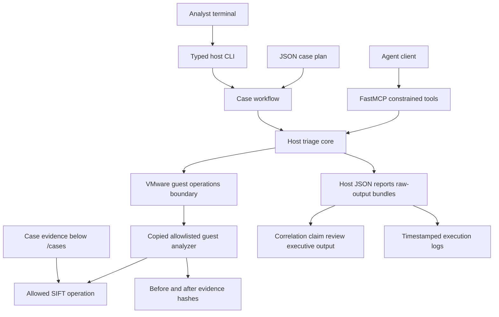

# Architecture

## Submission Pattern

Find Evil SIFT follows the custom MCP server pattern. The MCP and CLI layers
expose typed case operations while the SIFT guest receives copied allowlisted
analyzers for bounded forensic work. The workflow does not expose an arbitrary
guest-shell tool to the agent.

## Trust Boundary

The first boundary is between the Windows host project and the SIFT guest VM.
The host may start the VM and request read-only health information through
VMware guest operations. The project must not treat arbitrary shell access as
the eventual forensic API.

## Product Shape

The product keeps orchestration on the host, uses VMware guest operations to
reach the SIFT VM, and restricts each guest analyzer to the operations needed
for its lane. Current lanes cover PCAP triage, mount-free disk inventory,
exported Autoruns CSV triage, exported protected registry hives through
RegRipper, exported UserAssist execution context from NTUSER hives, and bounded
memory string pivots. A host correlation step consumes preserved lane summaries.

## Guardrails

Architectural guardrails:

- Case plans and guest analyzers reject evidence paths outside `/cases`.
- Each guest analyzer allowlists the tools or Python-only parsing it uses for
  its lane.
- The disk lane uses mount-free inventory rather than mounting evidence for
  broad host-side writes.
- Guest outputs are copied back to the host as summaries, reports, and raw
  output bundles with evidence hashes preserved before downstream correlation.

Workflow guardrails:

- Benchmarked lanes retry only inside a bounded attempt cap.
- Discovery-generated memory placeholders become recorded `lane_adjusted`
  review events instead of wasteful memory scans.
- Failed planned artifacts remain visible in the execution trace while later
  artifacts and lanes can continue when usable summaries still exist.
- Claim review keeps candidate and volatile pivots out of executive promotion.

## Evolution

The competition-facing system should evolve toward:

- A constrained tool service with explicit read-only and evidence-touching
  operations.
- Structured outputs with command provenance, timestamps, hashes, and errors.
- An agent workflow that can retry and self-correct without inventing findings.
- Benchmarks that compare findings against ground truth and verify that evidence
  inputs were not modified.

Raw guest shell access is useful for setup and debugging. It is not the API we
want judges to trust.
